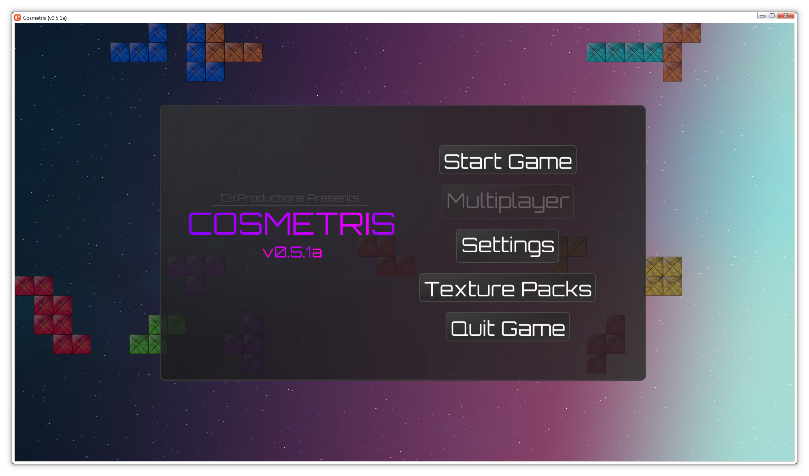
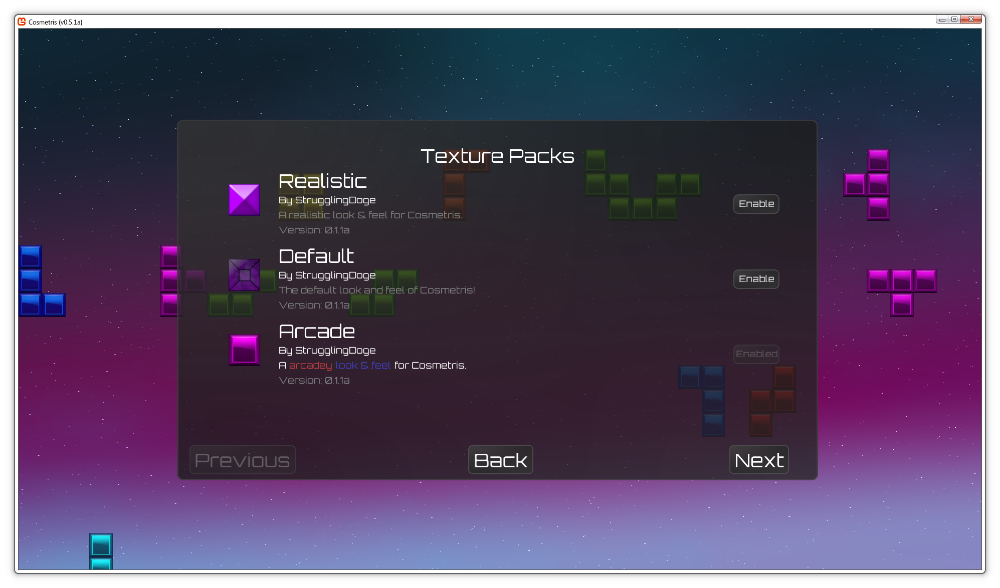
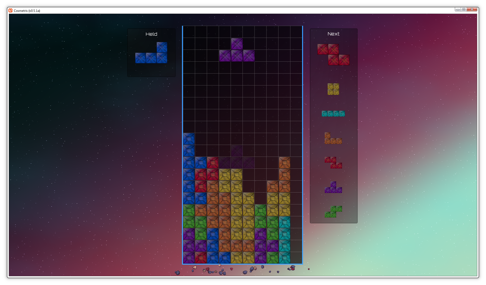
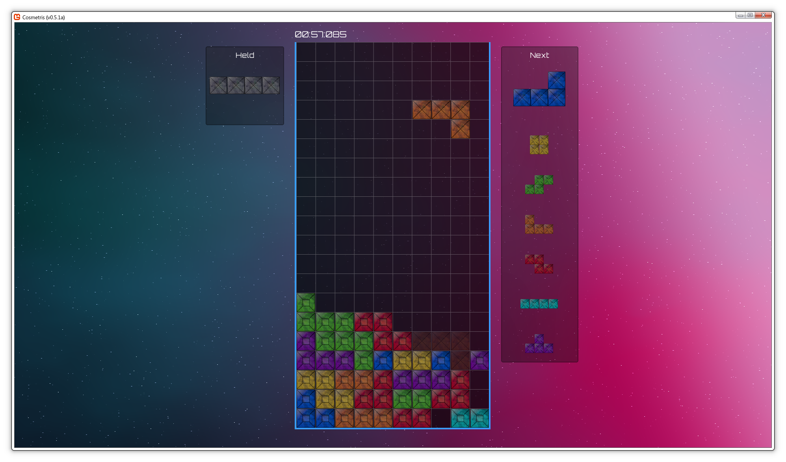

# Cosmetris - Alpha Testing

Cosmetris is an open source, free take on the modern day Tetris games. The aim of Cosmetris is to provide a comparable gameplay experience, including systems like the Super Rotation System (SRS), and small, important gameplay details like lock delay, controller input delay, and much more.

# Features

Right now, Cosmetris is in an Alpha development state. Along with that, the development is on and off, meaning updates may be slow at times. Many of these features take a lot of time to not only implement, but also takes time to make sure each feature makes sense and works properly in the game.

## Fully customizable

Cosmetris aims to provide a ton of customizability to the user, allowing to create and personalize the perfect theme.

Cosmetris includes a beautiful galaxy shader for the background, which you can customize to your liking. Later on, you will also be able to customize UI controls like Buttons, Labels, and more!

## Texture packs

Cosmetris includes the ability to create and share texture packs! In fact, this repo includes some extra themes you can download now! Installing texture packs is super easy, simply navigate to the Cosmetris save folder, and drag and drop a **unzipped** (Using zipped files will currently crash the game) texture pack, adhering to the correct format.

_For Windows, the save folder can be found in %appdata%/Cosmetris/_

_For macOS, the save folder can be found in ~/Library/Application Support/Cosmetris/_

_For Linux based systems, the save folder can be found in ~/.local/share/Cosmetris/_

If you are interested in making your own custom texture packs, take a look at the provided themes in the `themes` folder in this repository. Important to note though, since this game is in early development still, the layout may change in the future.

## Perfect Input Options

Cosmetris tries its best to provide the best gameplay experience to all players, including the best of the best. 

First, controllers are fully supported! In fact, implementation of future input methods should be fairly simple! The other great thing about the input system in Cosmetris, is that the user can customize the input delay of each individual control, per input device. Take for example, you dislike how long it takes between each button press for a particular button, you can simply change how long of a delay you want in MS. It goes a lot further than that aswell, take a look!

## Gamemodes

Cosmetris includes multiple gamemodes allowing for many different feels and gameplay experiences. Each gamemode allows you to change settings like the gravity interval, lock delay, the ability to disable holding of cosmonoes, and even set whether or not the ghost piece should be shown.

### Survival

Survival is your modern, unchanged game of Tetris, using the SRS guidelines & rotation systems. Your goal in this mode is to simply try to survive as long as possible without topping out!

### 40 Line

40 Line is very similar to survival, except, instead of being an endless survival, you are trying to clear 40 lines as fast as you can!

### Time Attack

Just like 40 Line, Time Attack is very similar to Survival, except in this mode you are given 3 minutes to get the highest score you can! Once the timer reaches zero, the game is over, no matter what!

### Punisher

This mode is for the ones that want a VERY challenging gameplay experience. This game mode is exactly what it says, a punishment. Throughout the entirety of this mode, your goal is to get t-spins, perfect clears, and high line clears in general. You definitley don't want to find out what happens if you don't!

# What's next?

There are multiple features that are still not quite ready for release yet, notably Multiplayer. I am one single person, so development of these features take time, so please be patient!

### Multiplayer

Multiplayer will absolutley take a while; previous iterations of the multiplayer have been quite buggy and it is important to make sure Cosmetris implements a stable, consistent online experience to users. Right now, the plan is to implement basic 1 on 1 lobbies, hopefully expanding to allow more players later.

### More customization

More customization will be added to Cosmetris in the coming updates. As mentioned earlier, there are plans to allow for more customization relating to the UI, like buttons and labels for example. Along with that, there are plans to implement a way to include custom sound effects & music in texture packs as well.

### Optimizations

Of course, with future updates optimizations are expected, but right now, the current font rendering system can sometimes cause some framerate issues, and is actively being worked on. If you play with VSync, this issue shouldn't be an issue.

# Contributions

Contributions are very welcome and encouraged! This is OSS, so please feel free to open issues or submit any pull requests!